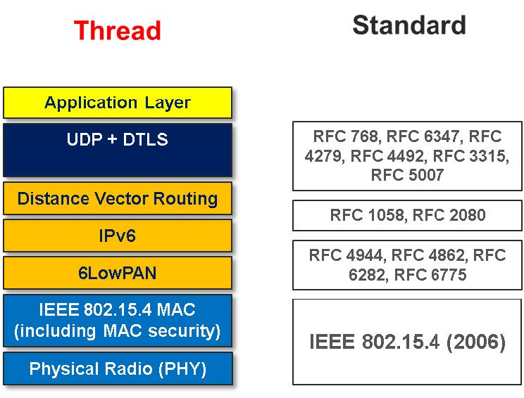
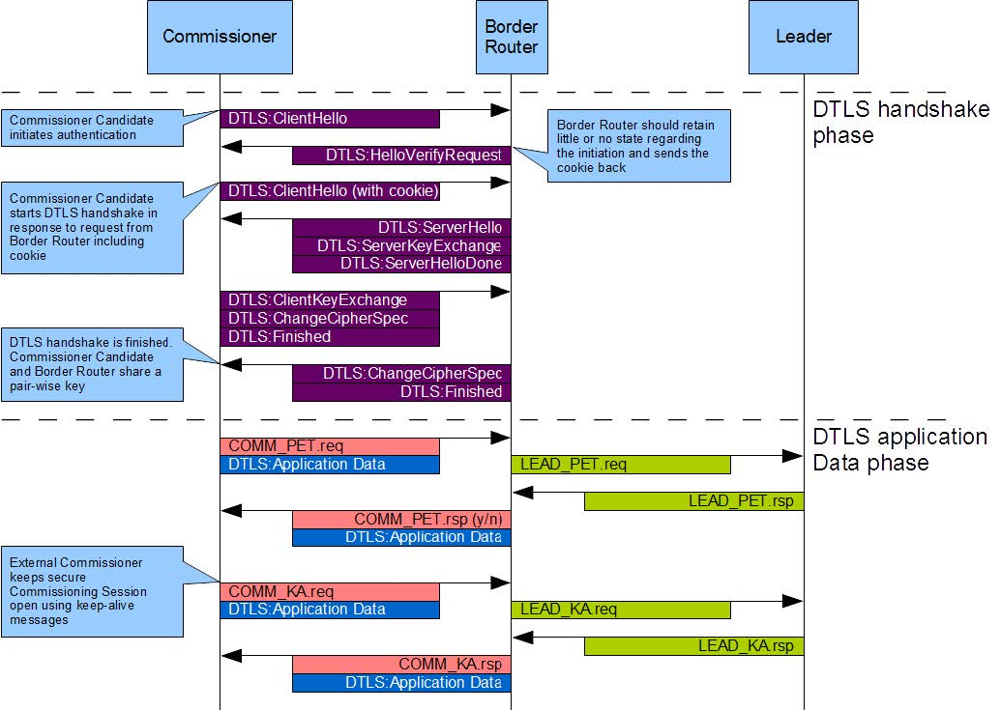
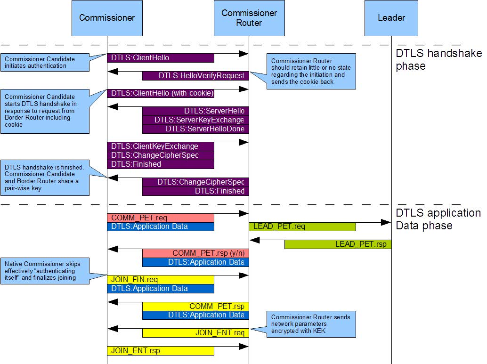
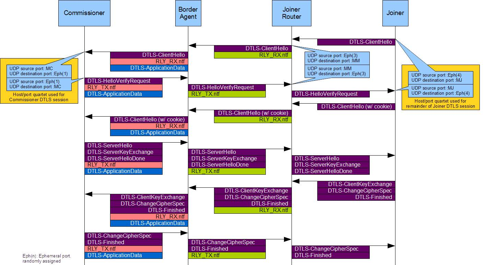
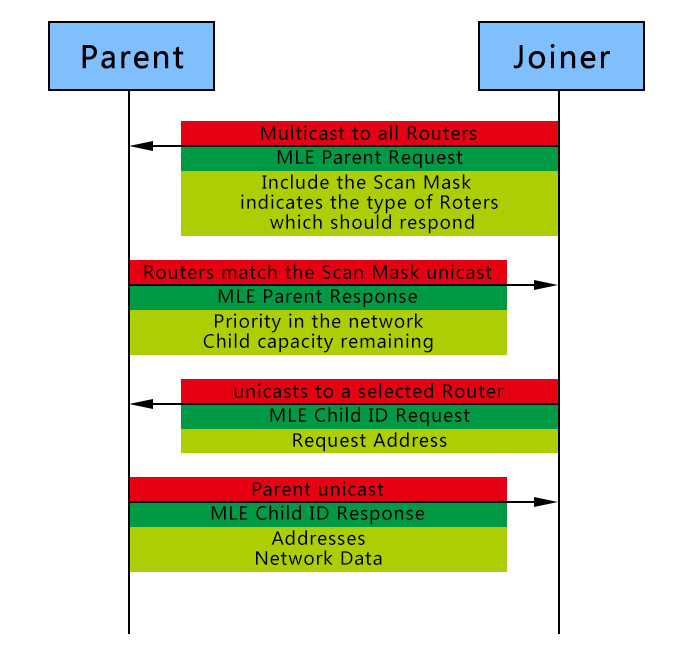

# Thread Study Note #

## Introduction ##

## Type and Role of Devices ##
* Full Thread Device (FTD)
  * Active Router
  * Router-Eligible End Device (REED)
  * Full End Device (FED)
* Minimal Thread Device (MTD)
  * Minimal End Device (MED)
  * Sleepy End Device (SED)
* Roles can be combined in any device
  * Leader
  * Border Router
  * Commissioner

FTDs can communicate with each other and with their attached MTD Children. MTDs can only communicate with the FTD Parent they are attached to.

### Router ###
Routers provide routing services to network devices. Routers also provide joining and security services for devices trying to join the Thread Network.

After forming a network, the forming node becomes the first Router in the Thread Network partition and selects a Router ID for itself.

Devices initially attach to the Thread Network as a REED, and may request to become Routers at any time after attaching.

### Leader ###
There is a device acting as the Leader. And there can be only **ONE** Leader at a time.

The Leader's main functions:
* Assign and manage Router IDs, 0...62 (Router ID 63 is reserved).
* Collate and distribute the Thread Network Data.

### Border Router ###
A Border Router is a device capable of forwarding between a Thread Network and a non-Thread Network. There may be one or more Border Routers in a Thread Network.

### Commissioner ###
There is an on-mesh commissioning device or an off-network commissioning device, a mobile phone or a server in the cloud, acting as the Commissioner. There can be only **ONE** active Commissioner at a time.

The Commissioner is the currently elected authentication server for new Thread devices and the authorizer for providing the network credentials they require to join the network, and typically provides the interface by which a human administrator manages joining a new device to the Thread Network.

## Forming a Network ##
Normally the device performs an energy scan to pick a quiet channel and then an active scan to verify which PAN IDs may be already used by other networks in range.

The device MUST choose the following values upon starting a Thread Network.
* PAN ID: 2 bytes in length set as the macPANId IEEE 802.15.4 PIB attribute for all nodes
* Master Key: 16 bytes in length, chosen using a cryptographically-sound random number generator, used to derive security material for MAC and MLE protection.
* Commissioning Credential: This is human-readable key, 8-255 bytes in length, used to form the PSKc used when authenticating a Commissioner.
* Mesh-Local Prefix: an IPv6 Unique Local Address (ULA) prefix used for communication within the Thread Network.
* Extended PAN ID: a randomly chosen 8-byte value, used to uniquely identify Thread Networks in range.
* Network Name: a human-readable name for the network, up to 16 bytes in length.

## Joining a Network ##
When a device, Joiner, wishes to join a Thread Network, there must be a device has became Commissioner by Petitioning.

### Petitioning ###
Petitioning is the process of authenticating and authorizing a Commissioner Candidate onto the Thread Network. And this process is protected by an enhanced key derived from Commissioning Credential using key stretching called the PSKc (Pre-Shared Key for the Commissioner).
* External Commissioner Candidate  
  A Border Router as a representative  
  After Petitioning there is a security session protected by DTLS
  

* Native Commissioner Candidate  
  The Commissioner Router as a representative
  

### Joining ###
Before joining, the Joiner must knows the network's current channel and PAN ID, If it does not, it will need to use the Discovery Request message to locate devices on the network.

As the Joiner is untrusted at the point of joining, there is a responsibility of the Commissioner to authenticate the Joiner. After authentication the Joiner acquire Thread Network Data with the Mesh Link Establishment (MLE).

If the Joiner can't communication with the Commissioner directly there are some devices like Joiner Router and Border Router as representative transfering data between the Joiner and the Commissioner.

* Authentication

* Attaching

## Security ##
The communication of Thread Network is protected by The Thread Master Key (thrMasterKey). *thrMasterKey* is used to derive two separate keys with HMAC-SHA256 for use by the MAC sublayer and MLE.

Petitioning and Joining are protected by DTLS with Elliptic Curves Cryptography (ECC). The DTLS handshake uses a user-input passphrase to authenticate a device.

> ## Reference ##
> 1. Thread v1.1.0 Specification
> 2. Thread Technical Overview (5 October 2015 Berlin)
